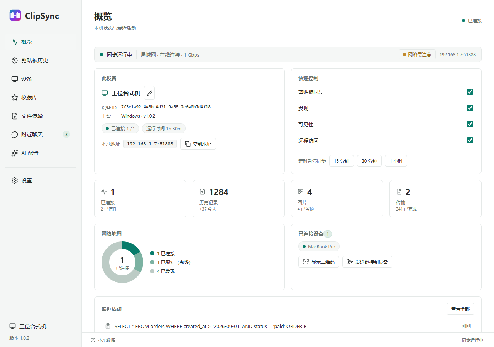
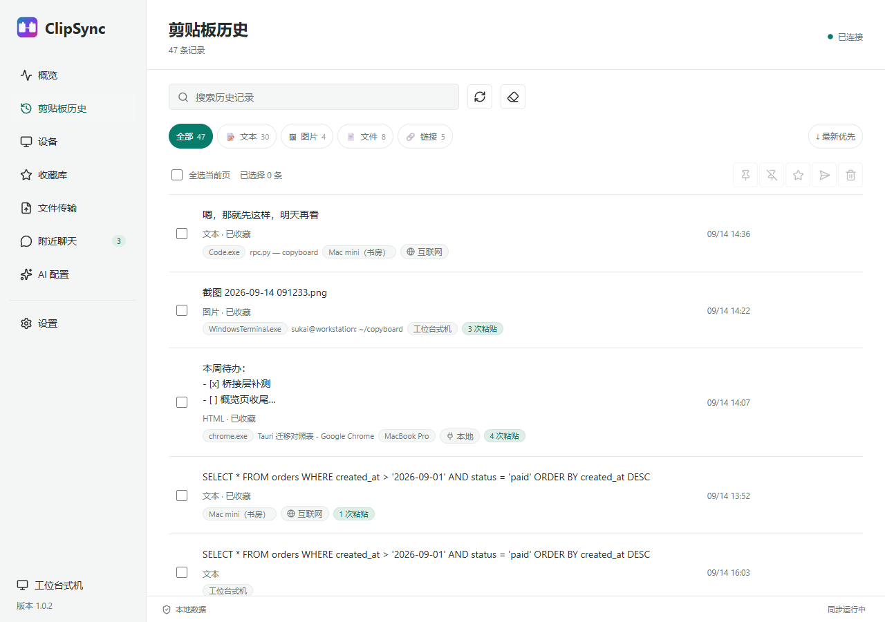
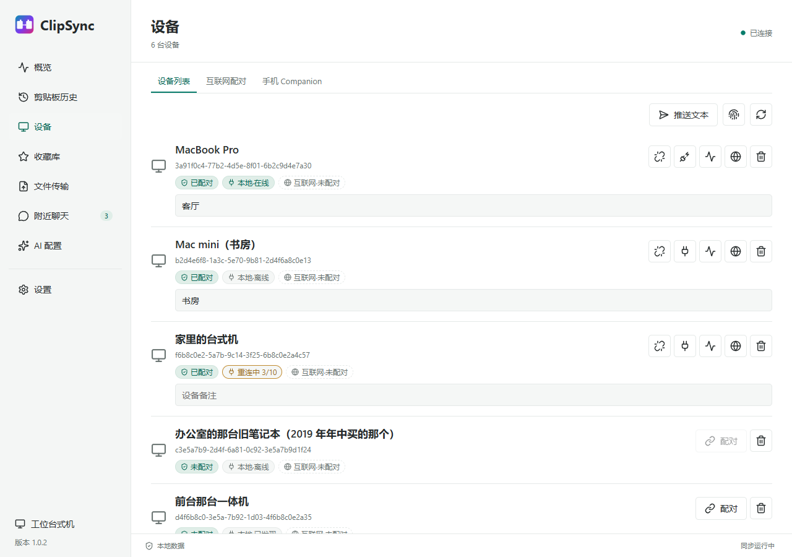
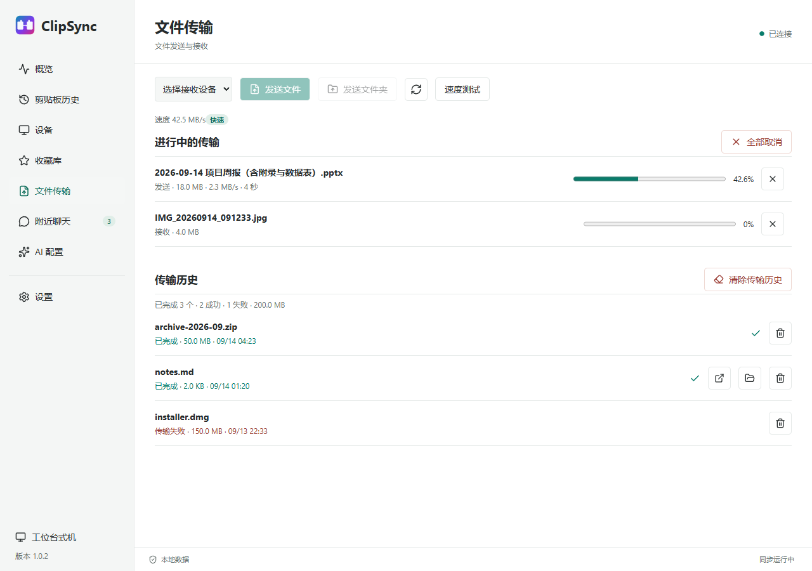
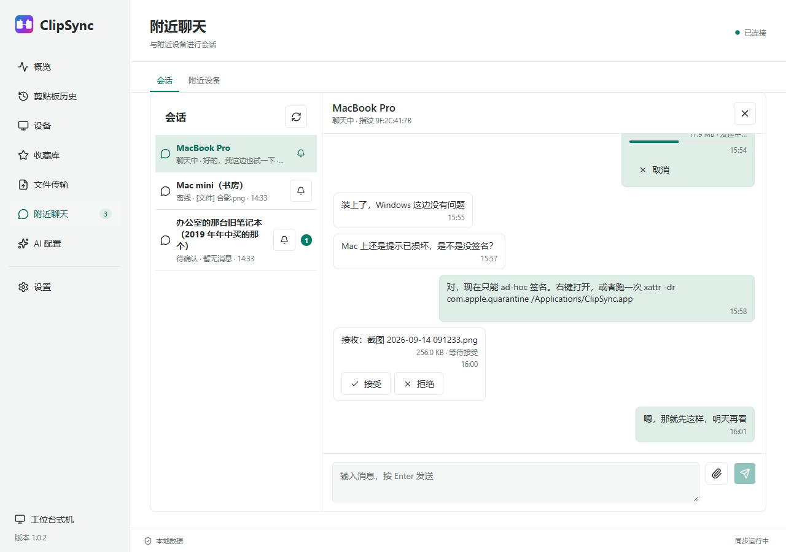
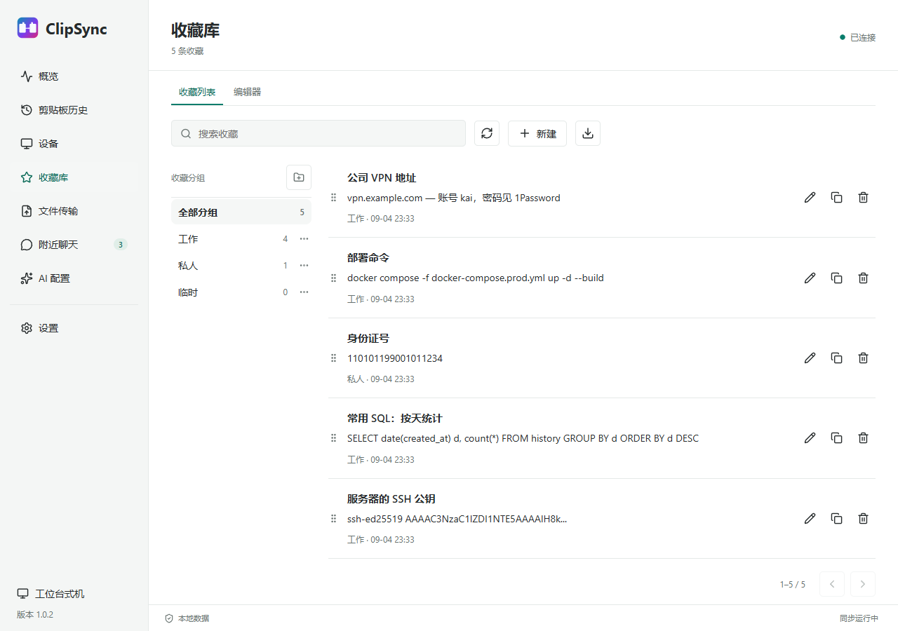
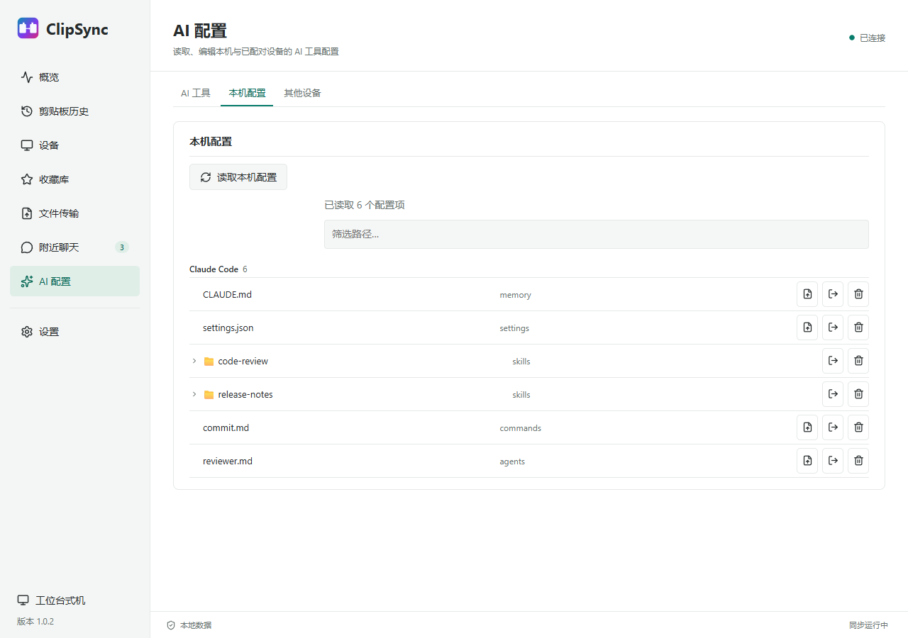
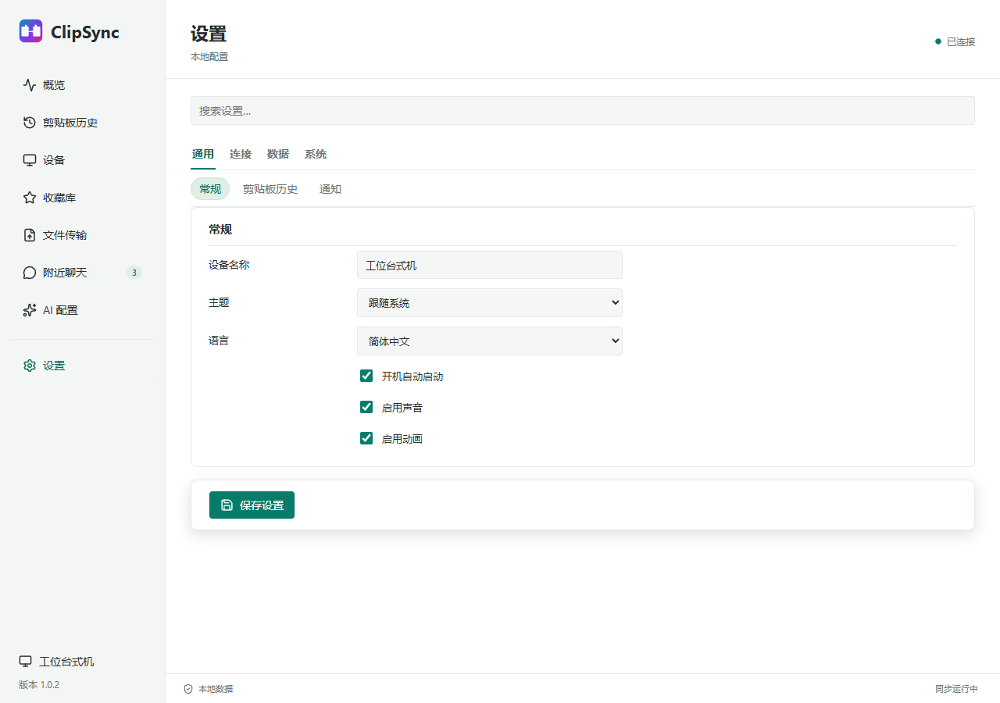

<p align="center">
  <a href="README_en.md">English</a> &nbsp;|&nbsp;
  <a href="README.md">中文</a>
</p>

<p align="center">
  
</p>

<h1 align="center">ClipSync</h1>

<p align="center">
  <strong>一台设备复制，另一台即刻粘贴。</strong><br>
  局域网直连 &middot; 端到端加密 &middot; 无需账号、无需云端
</p>

<p align="center">
  <a href="https://github.com/kai3316/clipsync/releases"></a>
  <a href="LICENSE"></a>
  
  
  
</p>

<p align="center">
  
</p>

---

## 这是什么

你在台式机上复制了一段内容，想粘贴到笔记本上。你在手机上复制了一个链接，想直接丢给电脑。你电脑上有个文件，想让旁边那台机器也拿到。

ClipSync 让这些设备彼此直连：**同一局域网内自动发现、加密传输，不需要账号，不经过任何服务器**。剪贴板里的文字、HTML、RTF、图片会实时同步到其他设备；文件和文件夹可以点对点传输；两台机器不在同一个网络时，可以选择走加密中继；手机不用装 App，扫码即可接入。

桌面端是一个原生窗口（Rust + Tauri），业务逻辑跑在一个自带的 Python 服务里 —— **安装包自带运行时，终端用户不需要装 Python**。

---

## 快速开始

1. 到 [Releases](https://github.com/kai3316/clipsync/releases/latest) 下载对应平台的安装包
2. 两台设备接入**同一个局域网**，各自启动 ClipSync
3. 在任意一台上发起配对，两端会显示同一个 **8 位配对码**，核对一致后确认
4. 一台复制，另一台粘贴

> **macOS 首次打开：** 两个应用都只做了 ad-hoc 签名（未公证，需要付费的 Apple 开发者账号）。如果提示"已损坏，无法打开"，在终端执行一次：
>
> ```bash
> xattr -dr com.apple.quarantine /Applications/ClipSync.app
> ```
>
> 如果提示的是"无法验证开发者"，右键点击应用选择"打开"即可。

---

## 两个应用

这个仓库同时发布两个桌面应用，共用同一套业务逻辑与配置文件：

| | **ClipSync**（新桌面端） | **clipsync**（旧版） |
|---|---|---|
| 界面 | Rust + Tauri 原生窗口，Vue 3 | CustomTkinter |
| 状态 | **主推**，功能开发都在这里 | 维护中，只做稳定性修复 |
| 下载 | `ClipSync_<版本>_x64-setup.exe` / `.dmg` / `.deb` / `.AppImage` | `clipsync-windows.zip` / `clipsync-macos-arm64.zip` / `clipsync-linux*.tar.gz` |
| 适用 | 推荐所有新用户 | 需要在 Linux ARM64 上运行，或习惯旧界面 |

两者的配置、历史、配对关系存放在同一位置，互相兼容，可以换着用。

---

## 界面

八个页面，`Ctrl` / `Cmd` + `1`–`8` 直接跳转：

| 页面 | 内容 |
|---|---|
| **概览** | 同步状态、本机信息与地址、四个快速开关、网络地图、最近活动 |
| **剪贴板历史** | 全部记录、搜索、类型筛选、逐条复制 / 收藏 / 翻译 / 删除、批量操作 |
| **设备** | 配对管理、连接测试、设备备注、互联网配对、手机 Companion |
| **收藏库** | 分组管理、编辑器、一键推送到剪贴板 |
| **文件传输** | 发送文件 / 文件夹、拖拽发送、进度与续传、速度测试、传输历史 |
| **附近聊天** | 与附近设备会话，可发文字与文件，支持未配对设备 |
| **AI 配置** | 本机与已配对设备的 AI 工具配置清单、差异比对、迁移向导 |
| **设置** | 通用 / 连接 / 数据 / 系统 四组共十一张卡片，支持搜索 |

<p align="center">
  
  
  <br>
  
  
  <br>
  
  
  <br>
  
</p>

点关闭只是把窗口收起来，程序仍在托盘里跑；要真正退出，用托盘菜单里的「退出 ClipSync」。托盘菜单还可以直接开关同步、定时暂停、查看已连接设备、发送网址到设备、显示网页二维码、导出日志、检查更新。

---

## 功能

### 剪贴板同步

| 格式 | 支持 |
|---|---|
| 纯文本（UTF-8 / CF_UNICODETEXT） | ✅ |
| HTML（CF_HTML / `text/html`） | ✅ |
| RTF 富文本（CF_RTF / `text/rtf`） | ✅ |
| 图片（PNG / BMP / TIFF / DIB） | ✅ |
| EMF（Windows 图元文件） | ✅ |
| 文件（CF_HDROP / 文件列表） | ✅ |
| 链接（`public.url` / URL 文本） | ✅ |

按内容哈希去重，而不是按时间戳 —— 两台机器交替复制不会产生回声循环。设备断线后后台自动重连，设备页实时显示"重连中 N/M"进度。同步可以随时从概览页或托盘暂停 15 分钟 / 30 分钟 / 1 小时。

### 从另一台设备下载文件

A 设备复制了一个文件，B 设备的历史里会出现这一条，显示文件名和大小，按钮是 **下载** 而不是 复制。**在你点它之前，任何字节都不会移动。**

- 点击后向文件所在的设备发起请求，对方通过已配对的加密链路把文件发过来，落到和普通接收文件同一个"收到文件"目录
- 一个条目里的每个文件单独成一个传输任务，可以各自查看进度、重试、取消；文件夹会打包成一个 zip
- 请求里只带**文件名、大小和对方那条记录的编号**，不带路径 —— 路径只在命名它的那台机器上有意义，由那台机器自己决定这次请求可以取到哪些文件
- 两端剪贴板都不会被写入：本机并不拥有这个文件，谎称"已复制"没有意义
- 对方发不出来时会回一个明确的原因（文件已被移动或删除 / 那条记录不是文件 / 已经不在那台设备上 / 发送失败），窗口用你当前的界面语言把它讲出来

### 文件传输

- **点对点直传** —— 局域网内设备间直接传输，不经过中继
- **分块与续传** —— 大文件切成 1 MB 分块，带 ACK 确认重传，中断后可从断点继续
- **文件夹** —— 拖入文件夹自动打包成 zip
- **拖拽发送** —— 把文件拖到窗口上即可，再选目标设备
- **失败可见** —— 失败的传输保留在历史里并标注原因（磁盘不足 / 对端离线 / 超时等），可原样重试
- **速度测试** —— 测量已配对设备间的实际吞吐，给出"快速 / 良好 / 慢"评级

### 互联网同步

不在同一个网络时（比如公司 ↔ 家里）：

- **跨网同步** —— 在设置里开启"互联网同步"，文字和小负载经公共 MQTT / WebSocket 中继转发。零注册、零成本，中继地址可编辑，支持多个 broker 自动容灾
- **端到端加密** —— 中继只看到密文：密钥由两端设备各自派生，频道主题不可猜测。局域网直连始终是主路径，中继只是异网时的镜像通道，两端都收到时按去重收敛
- **配对时核对安全码** —— 配对确认时两端显示同一个短安全码（SAS），避免公网下配对码被中间人截获
- **送达确认与离线补发** —— 消息带回执，对方或中继离线时自动入本地队列，恢复后补发
- **中继连通性测试** —— 设置里可逐个测试 broker 的可达性与延迟

> 免费公共中继是公共服务，没有 SLA。大文件传输与聊天文件仍然只走局域网直连。

### 附近聊天

- **不需要配对** —— 和同一局域网里已发现但未配对的设备也能对话
- **严格双向同意** —— 对方必须显式接受邀请；接受之前不泄露任何内容
- 未配对设备会展示短证书指纹供线下核对，已配对设备自动接受
- 文字与文件都能发，文件复用分块传输通道，断线自动重连
- 邀请、消息、文件都有速率与并发上限；文件名消毒、路径穿越拦截

### AI 配置同步

- **内置四套工具档案** —— Claude Code（`CLAUDE.md` / `settings.json` / `skills`）、Codex（`config.toml`）、Cursor（`rules` / `commands`）、Gemini（`settings.json` / `GEMINI.md`），可勾选启用，也能填自定义路径。凭据文件（如 `auth.json`）默认排除
- **三选一，绝不静默覆盖** —— 每次拉取都要选：覆盖 / 另存副本 / 追加合并
- **差异比对** —— 每行标注 缺失 / 相同 / 本地新 / 远端新，拉取前就能判断方向
- **一键迁移向导** —— 选源设备 → 按工具分组的差异清单 → 一键应用（冲突默认跳过）
- **本机配置管理器** —— 不配对也能用：浏览、预览、编辑（自动留 `.bak`）、删除进回收站、打开所在文件夹
- **skills 文件夹整体递归拉取** —— 勾选一个技能目录即递归传输其中全部文件，带批量进度

### 收藏库

剪贴板里值得留下的东西单独存一份：分组管理、编辑标题与内容、拖拽排序、一键复制回剪贴板、导出为 Markdown。

### 手机伴侣

电脑上生成一个二维码，手机扫码即用 —— **不用安装任何 App**。

- **PWA** —— iOS / Android 上"添加到主屏幕"后是一个独立应用（独立的图标、启动页、离线外壳）
- 查看电脑的剪贴板历史，把文字推送到电脑剪贴板，收藏，发送文本
- 上传文件到电脑，下载电脑上的文件
- 聊天、查看传输列表
- 令牌认证（可更换、可清除；清除后端口对能访问到它的设备开放）
- 端口与开关都在"设备 → 手机 Companion"里

### 安全

- **TLS 1.3** —— 所有传输层加密，每台设备一对独立的 Ed25519 证书
- **AES-256-GCM** —— 应用层逐帧加密，双重加密
- **TOFU 配对** —— 首次信任后锁定对方证书指纹，之后指纹变化会告警（防中间人）
- **落盘加密** —— 私钥与剪贴板历史用 AES-256-GCM 加密存储，密钥由设备专属种子经 PBKDF2（60 万次迭代）派生
- **可选预共享密码** —— 为密钥再叠一层 PBKDF2 熵
- **局域网优先** —— 中继只在两台设备无法直连时使用，且看不到明文

### 隐私与数据

- **敏感内容过滤** —— 发送前按正则把信用卡号、身份证 / 社保号、API 密钥、私钥、密码替换为 `[FILTERED]` 并在历史中标注。邮箱地址默认**不**过滤，需要可在设置中显式开启
- **来源应用过滤** —— 排除名单或仅允许名单，按进程名
- **保留上限** —— 按条数和天数自动清理（0 表示永久），置顶项不受影响
- **多格式导出** —— JSON / CSV / Markdown，另有导入、备份与恢复
- **损坏自愈** —— 单条记录损坏会被隔离，不影响其余加载

### 诊断

七组检查（系统 / 网络 / 互联网 / AI 配置 / 聊天 / 传输 / 文件系统），每项给出 ok / warn / fail 与具体原因，并提供一键修复（例如放行防火墙、打开本地网络权限）。

---

## 平台支持

| 平台 | 包 | 说明 |
|---|---|---|
| Windows 10/11 x64 | `ClipSync_<版本>_x64-setup.exe` | 安装包，自带 Python 运行时 |
| macOS 12+（Apple Silicon） | `ClipSync_<版本>_aarch64.dmg` | **不支持 Intel Mac** |
| Linux x86_64 | `ClipSync_<版本>_amd64.deb` / `.AppImage` | CI 构建；主要验证在 Windows 与 macOS |

- **不支持 Intel Mac** —— 两个应用都只构建 arm64。
- **桌面版自己装更新** —— 检查到新版本后直接下载、安装并重启。Linux 的 `.deb` 会弹出一次系统密码框；`.AppImage` 不需要。上一代的 Python 独立版仍然是下载后由你替换。
- **没有全局快捷键** —— 只有窗口内快捷键（`Ctrl/Cmd+1`–`8` 切页，`Ctrl+F` 搜索，列表内方向键 / Enter / Delete）。这是刻意的，旧版的全局热键已被用户要求排除。
- **默认端口** —— TCP `19990`，mDNS `5353`。

---

## 常见问题

| 现象 | 可能原因 | 处理 |
|---|---|---|
| 互相发现不了 | 不在同一网段，或路由器开了 AP 隔离 | 确认同网段；关闭"AP 隔离 / 客户端隔离" |
| 互相发现不了 | 防火墙拦了 mDNS | 放行 UDP `5353` 与 TCP `19990`；或直接用诊断页的一键修复 |
| 已配对但不同步 | 对方未连接 | 设备页里对方应显示"已连接"；只显示"已配对"说明链路没建起来 |
| 已配对但不同步 | 同步被暂停 | 概览页或托盘的同步开关 |
| 证书变更告警 | 对方重装或重置了身份 | 确认是本人操作，否则移除设备重新配对 |
| 端口冲突 | `19990` 被占用 | 设置 → 网络与高级 → TCP 端口 |
| macOS 提示已损坏 | 未公证 + 下载隔离标记 | `xattr -dr com.apple.quarantine /Applications/ClipSync.app` |
| 手机打不开网页 | 不在同一局域网，或端口被占 | 确认手机与电脑同网；检查"手机 Companion"里的地址与端口 |
| 手机提示令牌失效 | 令牌被更换 | 重新扫描电脑上的二维码 |

---

## 从源码运行

**需要：** Python 3.12+、Node.js 22.12+、Rust stable（MSVC / 各自的 C 工具链）。

```bash
git clone https://github.com/kai3316/clipsync.git
cd clipsync
python -m venv .venv
.venv\Scripts\activate          # Windows
# source .venv/bin/activate     # macOS / Linux
pip install -e .
```

然后启动桌面端：

```powershell
.\Start-ClipSync.bat            # Windows
```

```bash
cd desktop && npm ci && npm run tauri -- dev    # macOS / Linux
```

> `Start-ClipSync.bat` 是**开发入口，不是打包好的应用**：它检查上面那三样依赖，第一次运行会在本机编译整个 Rust 应用，数据默认写在仓库里的 `.tauri-dev-data`。只想用的话请下载安装包。加 `-CheckOnly` 只做依赖检查。

旧版 Tk 界面仍可运行：`python src/main.py`（Linux 需要 `xclip` 或 `wl-clipboard`）。

---

## 架构

```
desktop/                      桌面窗口（Rust + Tauri 2）
  src/                        Vue 3 + TypeScript 界面
    App.vue                   外壳、侧栏、八个页面、全部对话框
    components/               Overview / Favorites / Transfers / Chat 视图
    stores/application.ts     窗口状态与 RPC 调用
    i18n/                     中英文字符串表
  src-tauri/                  Rust 侧：托盘、通知、自启、窗口、拖拽、桥接
    src/bridge.rs             把界面调用转发给 Python 服务
  e2e/                        Playwright 预览（无宿主时用假数据渲染整窗口）

src/sidecar_main.py           打包进应用内的 Python 服务入口
main.py                       旧版入口（重定向到 src/main.py）

internal/                     业务逻辑，两个界面共用
  adapters/sidecar/rpc.py     方法表：每个能力在这里登记
  application/use_cases/      用例层
  clipboard/                  各平台原生剪贴板读写、历史库、去重、过滤
  sync/                       同步、文件传输、附近聊天、AI 配置
  transport/                  TLS 1.3 连接、mDNS 发现、互联网中继
  security/                   Ed25519 身份、TOFU 配对、落盘加密
  web/                        手机伴侣与旧版网页面板（HTTP + WebSocket）
  ui/                         旧版 CustomTkinter 界面

clipsync-sidecar.spec         把 Python 服务打成单文件（排除 tkinter）
docs/                         落地页（GitHub Pages 的根目录）
```

### 数据流

```
剪贴板变化 (OS)
  → 平台剪贴板读取器（原生格式）
  → ClipboardContent（规范化模型）
  → 去重 → 编码（魔数 + 版本 + JSON + zlib）
  → 逐帧 AES-256-GCM
  → TLS 1.3 套接字
  → 对端解码 → 去重 → 写入剪贴板
```

文件走的是同一套连接，只是内容换成 1 MB 分块 + ACK。

### 安全模型

每台设备首次启动时生成一对 Ed25519 密钥，公钥即设备身份。第一次与另一台设备建立连接时，两端显示同一个 8 位配对码（由 TLS 1.3 会话派生），用户确认后对方证书指纹被锁定；此后指纹变化即告警。线缆上双重加密：TLS 1.3 提供传输层安全，每个帧体再独立做一次 AES-256-GCM。落盘的私钥与剪贴板历史同样是 AES-256-GCM。

---

## 开发

```bash
python -m pytest tests -q          # Python 测试
python -m ruff check .             # Python 静态检查

cd desktop
npm run build                      # 类型检查 + 前端构建
npm test                           # 前端单元测试
npm run test:e2e                   # 用假宿主把窗口渲染出来截图
cargo test --locked                # Rust 侧测试
```

`npm run test:e2e` 会用 `desktop/e2e/` 里的假数据把八个页面都渲染并截图到 `desktop/test-results/`，加 `CLIPSYNC_E2E_LANG=en` 可出英文版。

贡献流程见 [CONTRIBUTING.md](CONTRIBUTING.md)。

---

## 文档

| 位置 | 内容 |
|---|---|
| [落地页](https://kai3316.github.io/clipsync/) | 功能介绍、界面截图、下载入口 |
| [CONTRIBUTING.md](CONTRIBUTING.md) | 贡献流程与代码结构约定 |
| [`desktop/README.md`](desktop/README.md) | 桌面窗口自身的构建与调试 |
| [Releases](https://github.com/kai3316/clipsync/releases) | 每个版本的改动与下载 |

代码里每个能力都登记在 `internal/adapters/sidecar/rpc.py` 的方法表上，窗口那一侧对应的是一张 Tauri 命令表——两边的对应关系写在代码旁边的注释里，不另立文档。

---

## 许可证

MIT —— 详见 [LICENSE](LICENSE)。
