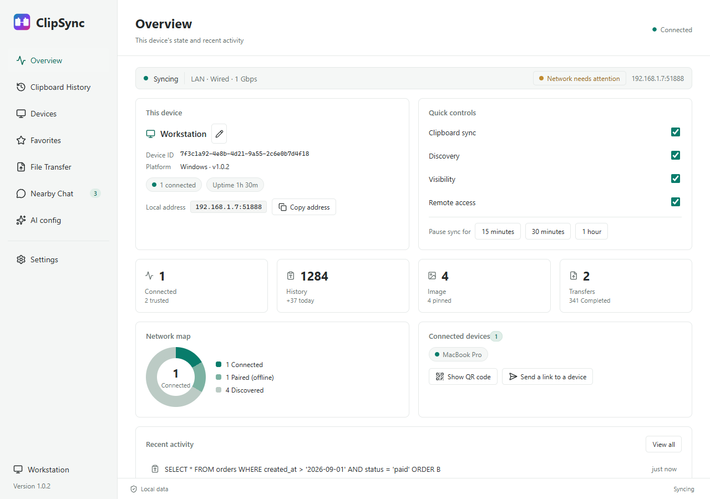
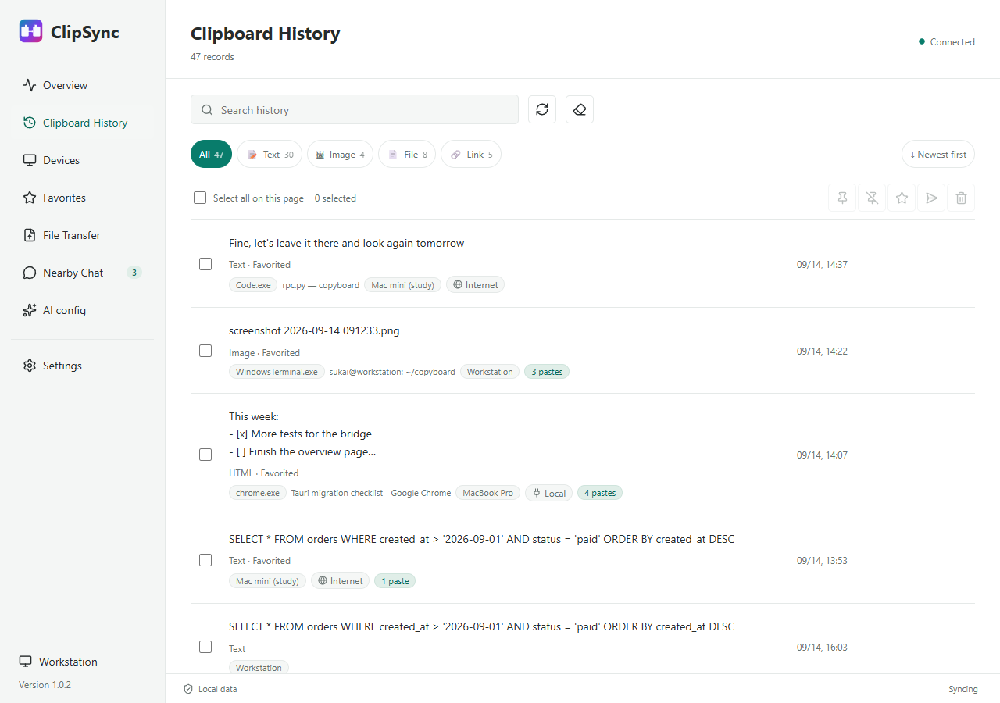
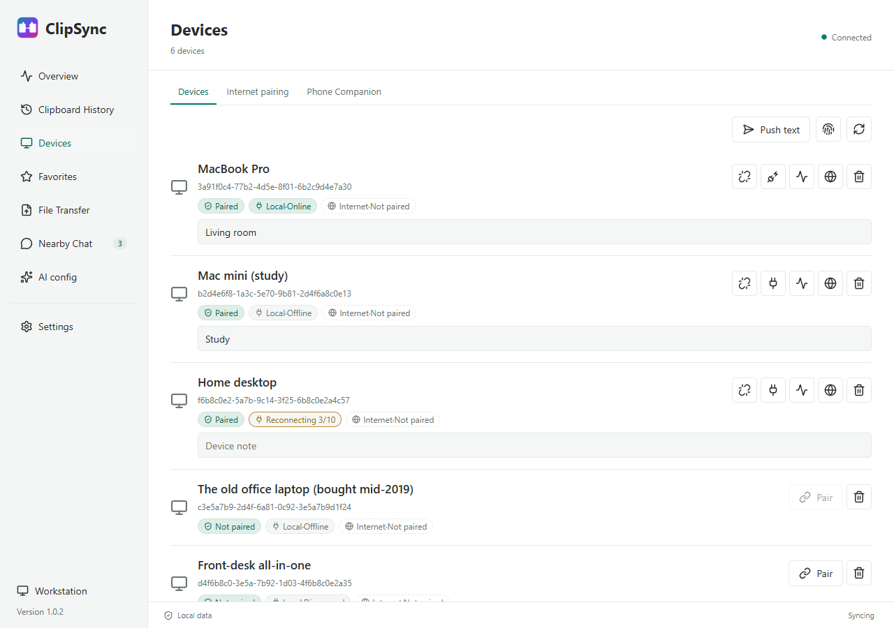
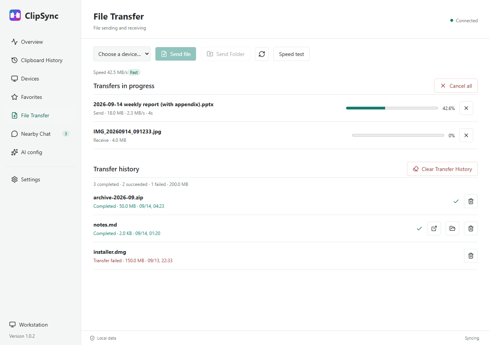
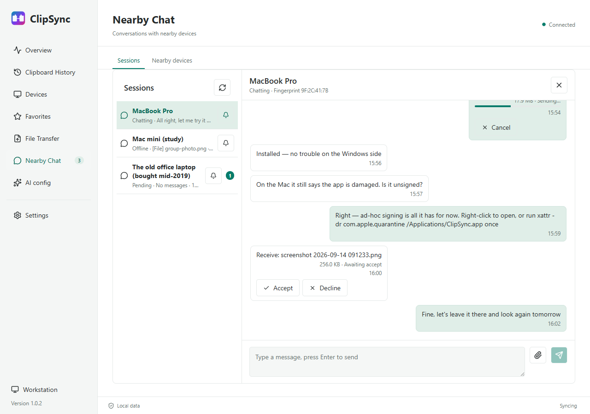
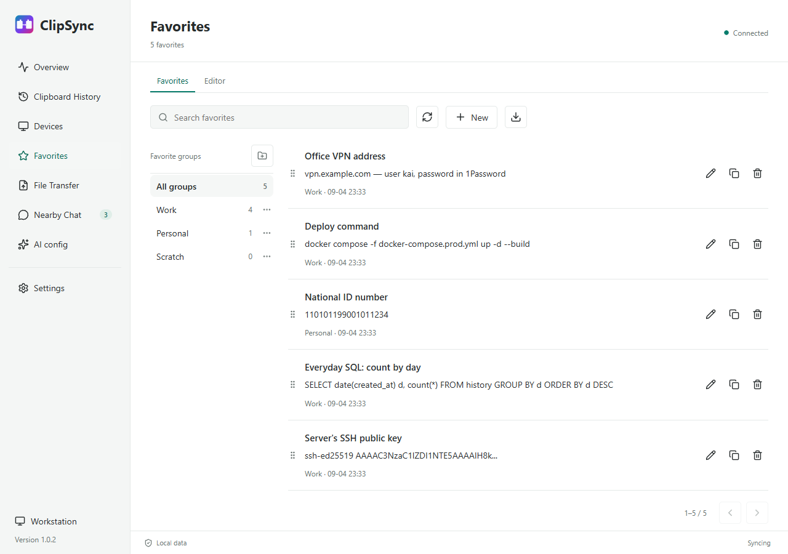
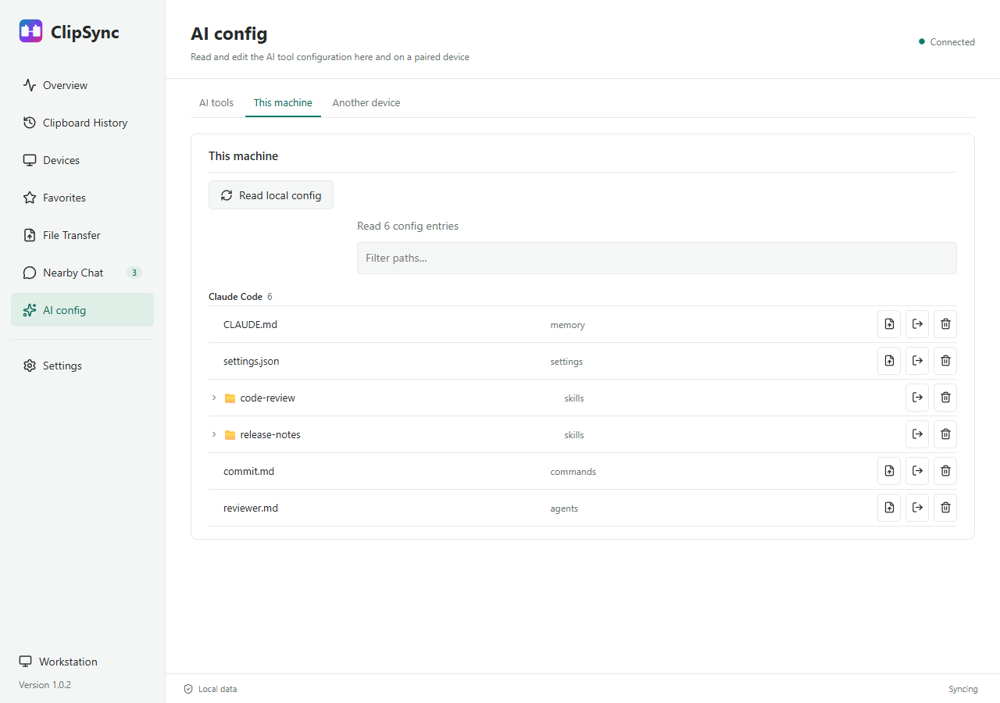
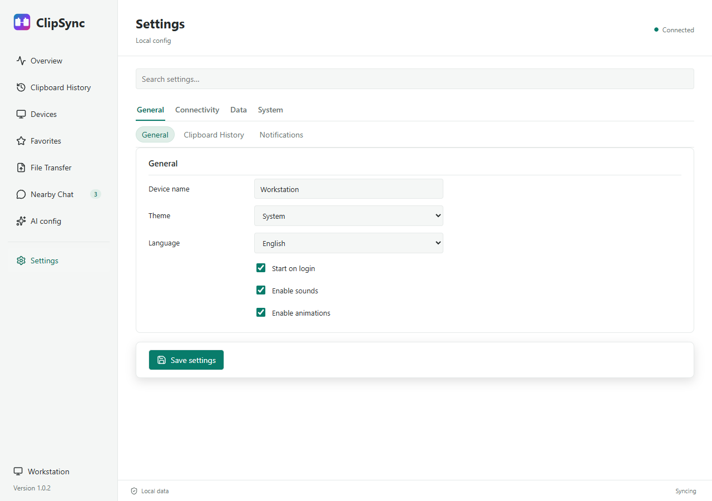

<p align="center">
  <a href="README_en.md">English</a> &nbsp;|&nbsp;
  <a href="README.md">中文</a>
</p>

<p align="center">
  
</p>

<h1 align="center">ClipSync</h1>

<p align="center">
  <strong>Copy on one device. Paste on another.</strong><br>
  Direct over your LAN &middot; end-to-end encrypted &middot; no account, no cloud
</p>

<p align="center">
  <a href="https://github.com/kai3316/clipsync/releases"></a>
  <a href="LICENSE"></a>
  
  
  
</p>

<p align="center">
  
</p>

---

## What this is

You copied something on the desktop and want it on the laptop. You copied a link on your phone and want it on the computer. You have a file on one machine and want it on the other one.

ClipSync connects those devices directly: **discovered automatically on your LAN, encrypted in transit, with no account and no server in the middle.** Text, HTML, RTF and images in the clipboard sync live between devices; files and folders transfer peer to peer; when two machines are not on the same network you can route through an encrypted relay; and a phone joins by scanning a QR code with no app to install.

The desktop is a native window (Rust + Tauri) whose business logic runs in a bundled Python service — **the installer ships its own runtime, so end users never install Python.**

---

## Quick start

1. Download the installer for your platform from [Releases](https://github.com/kai3316/clipsync/releases/latest)
2. Put both devices on the **same local network** and start ClipSync on each
3. Start pairing on either one; both screens show the same **8-digit pairing code** — check that they match, then confirm
4. Copy on one, paste on the other

> **Opening it on macOS for the first time:** both applications are ad-hoc signed only (notarization needs a paid Apple Developer account). If macOS says the app "is damaged and can't be opened", run this once:
>
> ```bash
> xattr -dr com.apple.quarantine /Applications/ClipSync.app
> ```
>
> If instead it says the developer cannot be verified, right-click the app and choose Open.

---

## Two applications

This repository ships two desktop applications that share one set of services and one configuration file:

| | **ClipSync** (new desktop) | **clipsync** (previous) |
|---|---|---|
| Interface | Rust + Tauri native window, Vue 3 | CustomTkinter |
| Status | **The main application** — all feature work lands here | Maintained; stability fixes only |
| Download | `ClipSync_<version>_x64-setup.exe` / `.dmg` / `.deb` / `.AppImage` | `clipsync-windows.zip` / `clipsync-macos-arm64.zip` / `clipsync-linux*.tar.gz` |
| For | Everyone new | Linux ARM64, or the older interface |

They read the same configuration, history and pairing records, so you can switch between them.

---

## The window

Eight pages. `Ctrl` / `Cmd` + `1`–`8` jumps straight to one:

| Page | What it holds |
|---|---|
| **Overview** | Sync state, this machine's details and address, four quick switches, network map, recent activity |
| **Clipboard History** | Every clip, search, type filters, per-row copy / favourite / translate / delete, batch actions |
| **Devices** | Pairing, connection tests, per-device notes, internet pairing, the phone companion |
| **Favorites** | Groups, an editor, one-click push back to the clipboard |
| **File Transfer** | Send files and folders, drag-and-drop, progress and resume, speed test, transfer history |
| **Nearby Chat** | Conversations with nearby devices — text and files, paired or not |
| **AI config** | AI tool configuration on this machine and on paired devices, diffs, a migration wizard |
| **Settings** | Four groups, eleven cards, searchable |

<p align="center">
  
  
  <br>
  
  
  <br>
  
  
  <br>
  
</p>

Closing the window only puts it away — the app keeps running in the tray, and "Quit ClipSync" in the tray menu is what actually exits. That menu can also toggle sync, pause it for 15 / 30 / 60 minutes, list connected devices, send a URL to a device, show the web QR code, export logs and check for updates.

---

## Features

### Clipboard sync

| Format | Supported |
|---|---|
| Plain text (UTF-8 / CF_UNICODETEXT) | ✅ |
| HTML (CF_HTML / `text/html`) | ✅ |
| RTF (CF_RTF / `text/rtf`) | ✅ |
| Images (PNG / BMP / TIFF / DIB) | ✅ |
| EMF (Windows metafile) | ✅ |
| Files (CF_HDROP / file lists) | ✅ |
| Links (`public.url` / URL text) | ✅ |

Deduplication is by content hash rather than timestamp, so two machines copying back and forth do not echo. Devices reconnect in the background after a drop, and the devices page shows "reconnecting N/M" while they do. Sync can be paused for 15 minutes, 30 minutes or an hour from the overview or the tray.

### Downloading a file from another device

Copy a file on device A and device B's history shows the row — the file's name and size, with a **Download** button in place of Copy. **Nothing moves until it is pressed.**

- The click asks the device that owns the file; that device sends it back over the paired, encrypted link, into the same "received files" directory ordinary transfers land in
- Each file in an entry becomes its own transfer, so it can be watched, retried or cancelled on its own; a folder arrives as a zip
- The request carries the **file name, its size and the id of the row the other device stored** — never a path. A path only means something on the machine it names, so that machine decides which of its own files a request may reach
- Neither clipboard is written: this machine does not have the file, and claiming it was copied would be a lie
- When the other device cannot send it, it answers with a reason (the file has since been moved or deleted / the row is not a file / it is no longer on that device / the send failed) and the window words it in the language you are reading

### File transfer

- **Peer to peer** — files travel directly between devices on the LAN, never through the relay
- **Chunked, resumable** — 1 MB chunks with ACK and retransmission; an interrupted transfer resumes from where it stopped
- **Folders** — dropping a folder archives it into a zip automatically
- **Drag and drop** — drop files onto the window, then pick the target device
- **Failures are visible** — a failed transfer stays in the history with its reason (disk full / peer offline / timeout) and can be retried as it was
- **Speed test** — measures real throughput to a paired device and grades it

### Sync across networks

When the two machines are not on the same network (office ↔ home):

- **Cross-network sync** — turn on internet sync in Settings and text and small payloads travel over public MQTT / WebSocket relays. No registration, no cost; the relay list is editable and fails over automatically
- **End-to-end encrypted** — a relay sees ciphertext only: the key is derived by the two devices themselves and the channel topic cannot be guessed. The LAN path stays primary; the relay is a mirror for when there is no direct link, and receiving on both converges by deduplication
- **Verify a security code when pairing** — both devices show the same short code (SAS) for you to compare, which closes the gap where a pairing code could be intercepted on the open internet
- **Delivery receipts and offline queueing** — messages report back; while the peer or the relay is away they queue locally and are sent when it returns
- **Relay reachability test** — each broker can be tested for reachability and latency from Settings

> The public relays are a free public service with no SLA. Large file transfers and chat attachments still go only over the LAN.

### Nearby chat

- **No pairing needed** — talk to a device that has been discovered on the same LAN but not paired
- **Delivered straight through, no dialog** — every device on the LAN counts as trusted, and one that knows your pairing code more so: a session is live as soon as it opens and a file goes to the receive directory without a per-file prompt
- The trade-off is that the peer's device name and short fingerprint arrive with the invitation (they used to wait for you to accept): compare the fingerprint out of band when you need to be sure who it is
- **To ask for approval again** — Settings → LAN discovery → turn off "Anyone nearby can send messages and files". Every conversation and every file then waits for your Accept, and the peer's short fingerprint arrives ahead of the content so you can check it
- Text and files both travel over the chunked transfer channel, reconnecting after a drop
- What arrives lands only in the receive directory: file names are sanitised, path traversal is refused, and size, rate and concurrency caps apply — on a network you do not control (public Wi-Fi, say) those caps are the whole of the defence

### AI config sync

- **Four built-in tool profiles** — Claude Code (`CLAUDE.md` / `settings.json` / `skills`), Codex (`config.toml`), Cursor (`rules` / `commands`), Gemini (`settings.json` / `GEMINI.md`). Enable the ones you use, or point at custom paths. Credential files such as `auth.json` are excluded by default
- **Three choices, never a silent overwrite** — every pull asks whether to overwrite, save a copy alongside, or append and merge
- **Diffs** — each row is marked missing / identical / newer here / newer there, so the direction is clear before anything is pulled
- **One-click migration wizard** — pick a source device, review the differences grouped by tool, apply; conflicts are skipped by default
- **A local config manager** — works without pairing: browse, preview, edit (leaving a `.bak`), move to the recycle bin rather than delete, and open the containing folder
- **Whole skills folders** — ticking a skill directory pulls every file under it recursively, with batch progress

### Favorites

A separate shelf for the clips worth keeping: groups, an editor for the title and body, drag-to-reorder, one-click copy back to the clipboard, and export to Markdown.

### Phone companion

The desktop shows a QR code and the phone scans it — **no app to install.**

- **PWA** — adding it to the home screen on iOS or Android gives it its own icon, splash and offline shell
- Read the computer's clipboard history, push text to its clipboard, add favourites, send text
- Upload files to the computer and download files from it
- Chat, and see the transfer list
- Token authentication, rotatable and clearable (clearing leaves the port open to anything that can reach it)
- The port and the on/off switch live under Devices → Phone companion

### Security

- **TLS 1.3** on every connection, with a per-device Ed25519 certificate
- **AES-256-GCM** per frame at the application layer — encrypted twice over
- **TOFU pairing** — the peer's certificate fingerprint is pinned on first trust, and any later change raises an alert
- **Encrypted at rest** — the private key and clipboard history are stored with AES-256-GCM, the key derived from a device seed through PBKDF2 (600,000 iterations)
- **Optional pre-shared password** — adds another layer of PBKDF2 entropy to that key
- **LAN first** — the relay is used only when two devices cannot connect directly, and it never sees plaintext

### Privacy and data

- **Sensitive content filtering** — credit card numbers, national ID / social security numbers, API keys, private keys and passwords are replaced with `[FILTERED]` before sending, and marked in the history. Email addresses are **not** filtered by default; turn that on explicitly if you want it
- **Source application filtering** — an exclusion list or an allow-list, by process name
- **Retention limits** — by entry count and by age (0 means forever); pinned entries are exempt
- **Export** — JSON, CSV or Markdown, plus import, backup and restore
- **Self-healing** — a damaged record is quarantined instead of blocking the rest of the history

### Diagnostics

Seven groups (system / network / internet / AI config / chat / transfer / filesystem), each finding marked ok, warn or fail with a reason, and a one-click repair where one exists (allowing the firewall, granting local network permission).

---

## Platform support

| Platform | Package | Notes |
|---|---|---|
| Windows 10/11 x64 | `ClipSync_<version>_x64-setup.exe` | Installer; ships its own Python runtime |
| macOS 12+ (Apple Silicon) | `ClipSync_<version>_aarch64.dmg` | **Intel Macs are not supported** |
| Linux x86_64 | `ClipSync_<version>_amd64.deb` / `.AppImage` | Built in CI; primary testing is on Windows and macOS |

- **No Intel Mac builds.** Both applications are built for arm64 only.
- **The desktop app installs its own updates.** It downloads the new version, installs it and restarts. On Linux a `.deb` install asks for your password once; an `.AppImage` does not. The previous Python application still leaves replacing it to you.
- **No global hotkeys.** Only in-window shortcuts: `Ctrl/Cmd+1`–`8` for pages, `Ctrl+F` for search, and arrows / Enter / Delete in lists. This is deliberate — the previous application's system-wide hotkeys were excluded at the user's request.
- **Default ports** — TCP `19990`, mDNS `5353`.

---

## Troubleshooting

| Symptom | Likely cause | What to do |
|---|---|---|
| Devices cannot find each other | Different subnets, or AP isolation | Check they are on the same subnet; turn off AP / client isolation |
| Devices cannot find each other | A firewall blocking mDNS | Allow UDP `5353` and TCP `19990`, or use the one-click repair in diagnostics |
| Paired but not syncing | The peer is not connected | The devices page should say "connected" for it; "paired" alone means no link |
| Paired but not syncing | Sync is paused | The overview page or the tray |
| Certificate change alert | The peer reinstalled or reset its identity | If that was you, fine; otherwise remove the device and pair again |
| Port already in use | Something else holds `19990` | Settings → Network and advanced → TCP port |
| macOS says the app is damaged | Not notarized, and quarantine is set | `xattr -dr com.apple.quarantine /Applications/ClipSync.app` |
| The phone cannot open the page | Not on the same network, or the port is taken | Check the network and the address in Devices → Phone companion |
| The phone says the token expired | The token was rotated | Scan the QR code on the computer again |

---

## Running from source

**Requires:** Python 3.12+, Node.js 22.12+, and Rust stable with the platform's C toolchain.

```bash
git clone https://github.com/kai3316/clipsync.git
cd clipsync
python -m venv .venv
.venv\Scripts\activate          # Windows
# source .venv/bin/activate     # macOS / Linux
pip install -e .
```

Then start the desktop:

```powershell
.\Start-ClipSync.bat            # Windows
```

```bash
cd desktop && npm ci && npm run tauri -- dev    # macOS / Linux
```

> `Start-ClipSync.bat` is a **development launcher, not the packaged application**: it checks for the three toolchains above, compiles the whole Rust application on first run, and keeps its data in `.tauri-dev-data` inside the repository. If you just want to use ClipSync, download an installer. `-CheckOnly` runs the prerequisite checks and nothing else.

The previous Tk interface still runs: `python src/main.py` (Linux needs `xclip` or `wl-clipboard`).

---

## Architecture

```
desktop/                      The desktop window (Rust + Tauri 2)
  src/                        Vue 3 + TypeScript interface
    App.vue                   Shell, sidebar, the eight pages, every dialog
    components/               Overview / Favorites / Transfers / Chat views
    stores/application.ts     Window state and RPC calls
    i18n/                     Chinese and English string tables
  src-tauri/                  Rust side: tray, notifications, autostart, window, drag-drop, bridge
    src/bridge.rs             Forwards interface calls to the Python service
  e2e/                        Playwright previews (renders the window on fixtures, no host)

src/sidecar_main.py           The Python service, packaged inside the app
main.py                       Previous entry point (redirects to src/main.py)

internal/                     Business logic shared by both interfaces
  adapters/sidecar/rpc.py     The method table: every capability is registered here
  application/use_cases/      Use cases
  clipboard/                  Per-platform clipboard I/O, history store, dedup, filtering
  sync/                       Sync, file transfer, nearby chat, AI config
  transport/                  TLS 1.3 connections, mDNS discovery, internet relay
  security/                   Ed25519 identity, TOFU pairing, encryption at rest
  web/                        Phone companion and the previous web panel (HTTP + WebSocket)
  ui/                         The previous CustomTkinter interface

clipsync-sidecar.spec         Packs the Python service (a directory on macOS, one file elsewhere; tkinter excluded)
docs/                         The landing page (GitHub Pages root)
```

### Data flow

```
Clipboard change (OS)
  → platform clipboard reader (native formats)
  → ClipboardContent (normalised model)
  → dedup → encode (magic + version + JSON + zlib)
  → AES-256-GCM per frame
  → TLS 1.3 socket
  → peer decodes → dedup → writes the clipboard
```

Files take the same connection; the payload is just 1 MB chunks with ACKs.

### Security model

Each device generates an Ed25519 key pair on first launch, and the public key is its identity. The first time two devices connect, both show the same 8-digit pairing code derived from the TLS 1.3 session; once the user confirms, the peer's certificate fingerprint is pinned and any later change is treated as an alert. Data is encrypted twice in flight: TLS 1.3 provides transport security, and every frame body is separately encrypted with AES-256-GCM. The private key and clipboard history on disk use the same cipher.

---

## Development

```bash
python -m pytest tests -q          # Python tests
python -m ruff check .             # Python lint
npm run test:web                   # frontend tests for the previous web panel (phone companion)

cd desktop
npm run build                      # typecheck + frontend build
npm test                           # frontend unit tests
npm run test:e2e                   # renders the window on fixtures and photographs it
cargo test --locked                # Rust tests
```

`npm run test:e2e` renders all eight pages against the fixtures in `desktop/e2e/` and writes a screenshot of each to `desktop/test-results/`. Add `CLIPSYNC_E2E_LANG=en` for the English set.

See [CONTRIBUTING.md](CONTRIBUTING.md) for the development workflow.

---

## Documentation

| Where | What |
|---|---|
| [Landing page](https://kai3316.github.io/clipsync/index_en.html) | What it does, screenshots, downloads |
| [CONTRIBUTING.md](CONTRIBUTING.md) | How to contribute, and the conventions the code follows |
| [`desktop/README.md`](desktop/README.md) | Building and debugging the desktop window itself |
| [Releases](https://github.com/kai3316/clipsync/releases) | What changed in each version, and the installers |

Every capability is registered in the method table at `internal/adapters/sidecar/rpc.py`, and the window's side of each one is the Tauri command table beside it; the correspondence is written in comments next to the code rather than in a second document.

---

## License

MIT — see [LICENSE](LICENSE).
